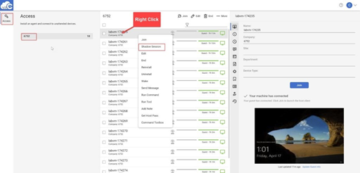
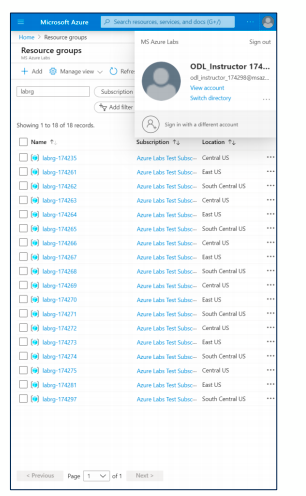
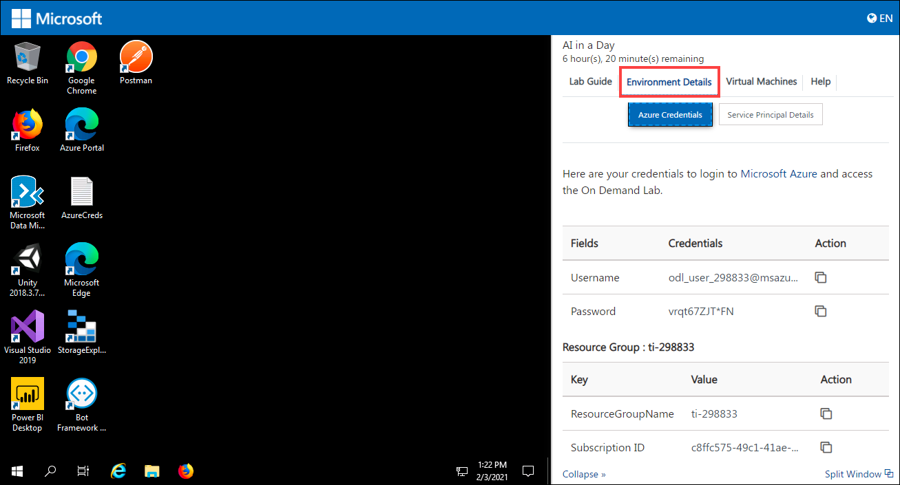
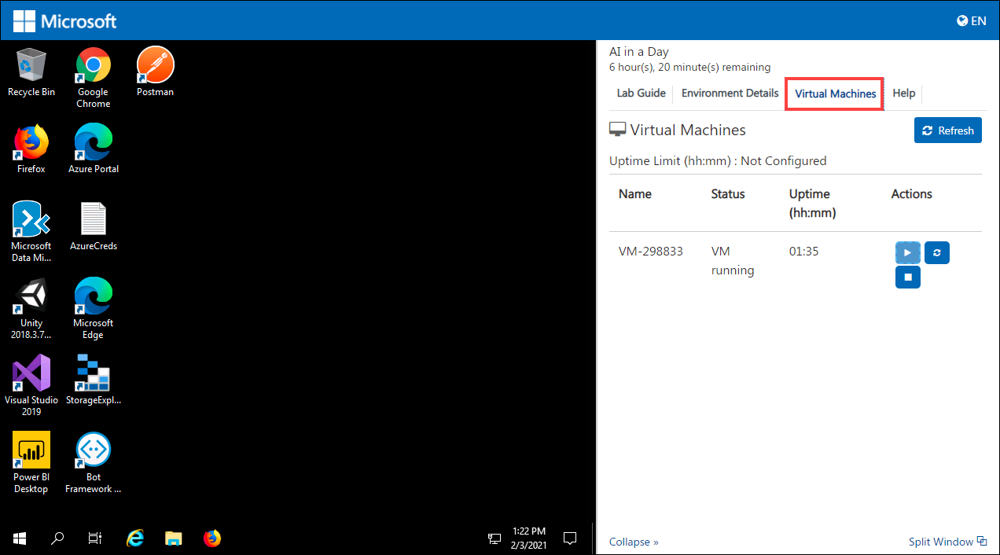
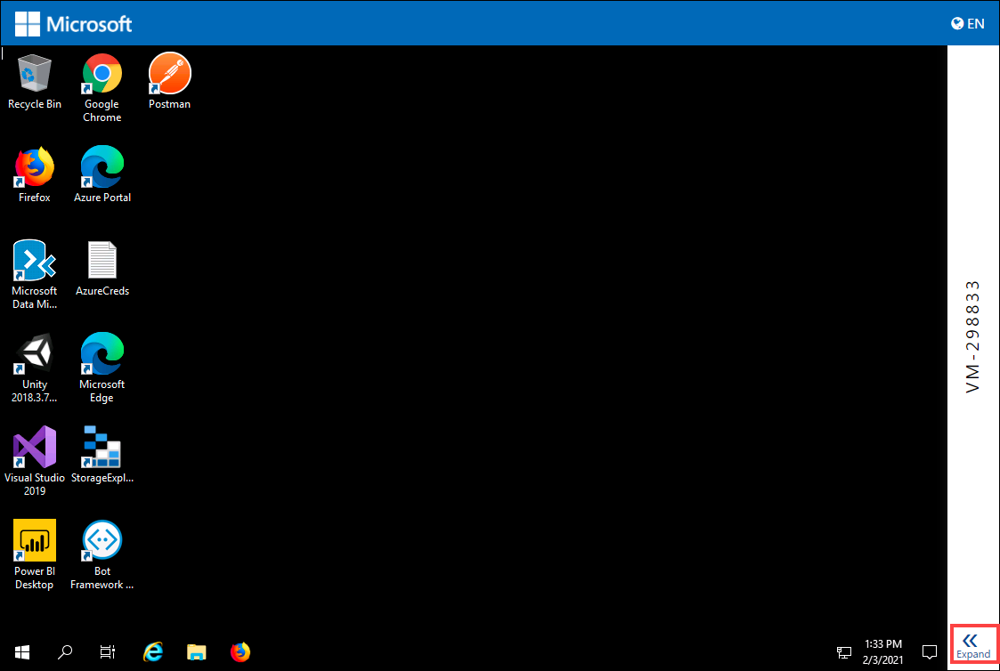
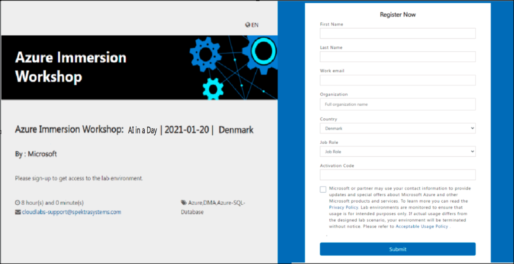
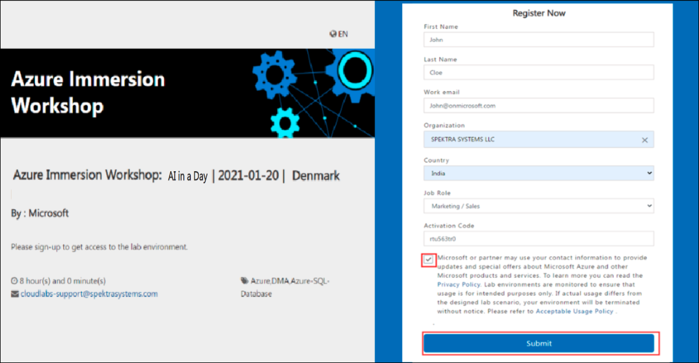
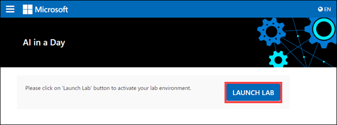
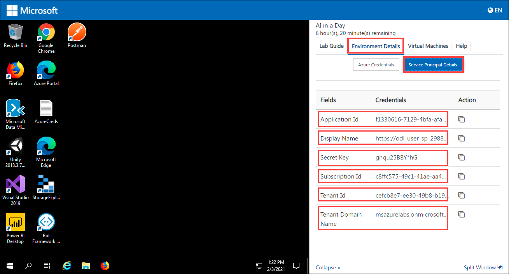

# AI IN A DAY

## Contents

- [How to navigate to the cloud labs portal](#how-to-navigate-to-the-cloud-labs-portal)
- [How to manage users and Unused instances](#how-to-manage-users-and-Unused-instances)
- [Vm Shadowing](#vm-shadowing)
- [RDP Over Https](#rdp-over-https)
- [VM Start/Stop ](#vm-startstop)
- [Instructor Azure Portal Access ](#instructor-azure-portal-access)
- [What do the attendees get when they sign up for the environment](#What-do-the-attendees-get-when-they-sign-up-for-the-environment)
- [Help Tab](#help-tab)
- [Split Window](#split-window)
- [Collapse Window](#collapse-window)
- [Resources that are provided as pre-requisites ](#resources-that-are-provided-as-pre-requisites)
- [Lab Contents](#lab-contents)
- [Known Issues and workarounds ](#known-issues-and-workarounds)
- [FAQ'S](#faqs)

## How to navigate to the cloud labs portal

- Open any browser and navigate to <https://admin.cloudlabs.ai/>  
- Click on sign in and then sign with Work or School Account.  
- Upon login, on demand lab will be available for management. 

   1. Ensure to select the right Cloud Labs tenant. 
   2. Navigate to On Demand Labs, then you will be able to find event ODL name.  
   3. From here you can find instructor credentials. With this credential you can access all the attendee’s azure environments. 
   4. From Users tab, you can find list of lab users with their deployment id. 
   
 
 
## How to manage users and Unused instances

- Navigate to user's tab from actions..  
- From here you can find the list of users with their deployment id and deployment details for each user.  
- You can manage attendees from this page  
- Add / Remove attendees  
- Each attendee is assigned a six-digit unique id to identify lab resource groups and jump VMs 

 

## Features available to instructors

### Vm Shadowing  

- You can shadow multiple attendee VMs at the same time.  
- Multiple instructors / proctors can shadow same attendee VM concurrently.  
- If you don’t see the username upon clicking “Shadow Session”, student may not have launched their Lab VM yet or is disconnected.  

1. Login to [https://admin.cloudlabs.ai](https://admin.cloudlabs.ai/) with your work account (<alias@microsoft.com> or <alias@partner.com>)   
1. Ensure to select the right Cloud Labs tenant (Microsoft – In a Day)  
1. Navigate to On Demand Labs  
1. Using instructor credentials, you can access all the attendee’s azure environments.  
    - Click on information icon from Actions to get Instructor Azure Credentials  
    - Use this username and password to login to Azure portal and CloudLabs Shadow  
    - Login from a private browser instance (InPrivate or Incognito)  

     

1. Navigate to user's tab from actions  
1. You can find the Deployment details for the user here. (you can use azure credentials from this page to access attendee cloud environment)  

   
 
   SCREEN CONNECT  

1. Navigate to [https://spektrasystems.screenconnect.com](https://spektrasystems.screenconnect.com/)  
1. Click on Login  

   

1. Login with local account, do not choose Azure AD.  
1. Use same username and password provided for Instructor Access  

    
 
    

1. OTP is sent to your work email account. Check and provide the OTP then Login.  
     - Please be sure to check junk/spam folder.  
     - Email is sent out from <cloud@screenconnect.com>  

    

1. Search for specific DID if needed, right Click on Lab User VM (Identified by DID) and Select Shadow Session  

    

1. Select Login Session – demouser or if you see any other username to connect the VM and click on Join Session 

    >Note: If you only see Console and [Backstage], that means attendee is not connected to VM currently  

    

1. Click on Open ScreenConnect Client and install the required software (One Time).  

    
    
1. Shadow users VM session (without overtaking RDP session).

    
1. You can initiate a private chat with attendee by clicking on messaging icon.

    

### RDP OVER HTTPS  

- Rdp over https is a feature which allows attendees to access the virtual machine over the internet. This eliminates the need of logging in into the vm by attendees.   

- With RDP OVER HTTPS and integrated doc rendering, attendees will be able see the virtual machine and lab guide on the same screen which makes easier to perform the lab.  

    
    
### VM Start/Stop  

- Attendees can start/stop the Virtual Machine from the Virtual Machine tab. We have provided button to start/stop VM under Actions.  

    
    
### Instructor Azure Portal Access 

1. Instructor has access to all attendees Resource groups and resources that are pre-deployed or deployed by attendee as a part of the lab. 

1. Instructor can login to the Azure portal with the credentials identified before and will be able to view the resources of all attendees. 

   
 
   

1. Since each attendee is assigned with a six-digit Suffix, it is easy for the instructor to view the resources of a particular attendee.  
    
    To find the attendees details:  
    
      - From the Cloud Labs portal home page, Click on **On Demand Labs** select the event ODL then click on user's tab from actions. From here, instructor can find the list of attendees with their deployment id and deployment details for each user. 
      - From the list of attendees, instructor can pick the Suffix of the desired attendee and can view the resources from the Azure portal. 

## How much time does the environment take to get deployed? 

The approximate Duration for deploying a single environment would be 30 minutes. 

## What do the attendees get when they sign up for the environment.  

1. As soon as the attendee’s environment is deployed, he will be able to see a virtual machine on the left which will be used to perform the lab. 

 1. On the right, Attendee will be able to find 

     1. A lab guide, which should be followed to perform the lab.  

          - Attendee can see the number on lab guide bottom area to switch to different exercises of lab guide.  

          - Attendee can also navigate to previous and next exercise using Previous and Next button. 
             
          
           
     1. Environment Details which include user credentials (Azure Credentials), Virtual Machine Credentials and other details. 
     
          

     1. Virtual Machines tab, attendee can find the available virtual machines, their status (running, pending or deallocated), Uptime and can also perform some actions on them.

          

          - Attendee can also perform the following operations on the virtual machine. 

               1. Start 

               2. Restart and

               3. Stop  

           
           

### Help Tab
    
1. From Help tab, attendees can find the common issues such as copy-paste, pop-up visibility issues and solutions to resolve them. 

    
   
   
### Split Window

- Split window will open the lab guide in new Window by providing the only virtual machine on the current window. 

    

### Collapse Window

1. Collapse button will collapse the lab guide window and provides the full view of the virtual machine.  

    
    
2. Attendee can get back the lab guide when needed by clicking on Expand button. 

     

**Average time taken to complete the lab: 8 hours** 

## Resources that are provided as pre-requisites. 

- Once the attendee logs in to the Azure portal, the following are the Pre-deployed resources that are provided to the attendees to perform the lab. 

    - Resource Group: hands-on-lab-UniqueID 

    - Virtual machine: VM-UniqueID and  

    - virtualNetwork: vNet1 

    - Networksecuritygroup: nsg-jumpvm 

    - NetworkInterfaces : jumpvmnic 

    - publicIpAddress: pip-jumpvm 

    - Storage account: techimmersionstrgUniqueID, mlstrgUniqueID 

    - CognitiveService: tech-immersion-translator, tech-immersion-cogserv, tech-immersion-form-recog-UniqueID, tech-immersion-anomaly-detector-UniqueID, techimmersion UniqueID 

    - Cosmosdb: tech-immersionUniqueID 

    - Functionapp: ti-function-day2-UniqueID 

    - Keyvault: tech-immersion-kv-UniqueID 

    - Appinsight: tech-immersion-appinsight-UniqueID, techimmersionaisightUniqueID 

    - ContainerRegistry: techimmersioncrUniqueID 

    - Machine Learning workspace: amlWorkspaceNameUniqueID 

 - In the upper left corner of the portal window, click the toggle menu icon and then click on **Resource groups,** then select the **SmartHotelHostRG** resource group and view the pre-deployed resources**.** 

### LAB CONTENTS

**AI, Experience 1 - Quickly build comprehensive Bot solutions with the Virtual Assistant solution accelerator**

-nIn this experience, attendee will use the Automotive Skill to quickly deploy a conversational bot trained to understand vehicle-based commands. This Skill is part of the Virtual Assistant accelerator and extends the base Virtual Assistant with an automotive industry-focused solution.  

**AI, Experience 3 - Better models made easy with Automated Machine Learning**

- In this experience, attendee will learn how the automated machine learning capability in Azure Machine Learning (AML) can be used for the life cycle management of the manufactured vehicles and how AML helps in creation of better vehicle maintenance plans.  

- To accomplish this, attendee will train a Linear Regression model to predict the number of days until battery failure using Automated Machine Learning in Jupyter Notebooks. 

**AI, Experience 4 - Creating repeatable processes with Azure Machine Learning pipelines**

- In this experience, attendee will learn how to create re-usable machine learning pipelines with Azure Machine Learning. Azure Machine Learning allows you to define distinct steps and make it possible to re-use these pipelines as well as to rerun only the steps you need as you tweak and test your workflow. 

- The goal is to build a pipeline that demonstrates the basic data science workflow of data preparation, model training, and predictions.  

- The machine learning pipeline in this QuickStart is organized into three steps: 

     1. Pre-process Training and Input Data 
     2. Model Training 
     3. Model Inference  

**AI, Experience 6 - MLOps with Azure Machine Learning and Azure DevOps**

- In this experience, attendee will learn how to use MLOps to formalize the process of training and deploying new models using the DevOps approach.

#### Average time taken to complete the lab: 8 hours 

## Known issues and workarounds

### Important!!

Whenever attendee is asked to provide values for **Resource group**, **Machine learning Workspace** and **Subscription Id**, make sure you proivde the correct values, you can find the values from the Environment Details page.  Not providing the correct values will lead to **Deployment issues** while deploying new resources. 

## FAQ’s 

#### How to access lab environment

1. Instructor share the bit.ly link and activation code during the event to attendees. 

    DO NOT share the activation details prior to session (Lab Start time) 

1. All attendees activate the lab instance using the same activation code. 

    

1. Attendee will navigate to the bit.ly link and provide the required details. 

1. Its mandatory to give company email address and actual organization name. 

    
        
1. Once lab instance is assigned, details are also sent to attendee via email from [noreply@cloudlabs.ai 
  ](mailto:noreply@cloudlabs.ai) 
  
1. Once attendee register using Lab activation details, he will click on Launch Lab to get started with the lab. 

   
    
1. Once the deployment is succeeded, attendee will get the screen with the lab guide, Environment Details (Azure Credentials), etc. on the Right Side and Virtual Machine on the Left. 

     
    

#### How to find the **SUFFIX** Value:

- Attendee can find the **Suffix** value by navigating to **Environment Details** page. 

#### How to find the **SERVICE PRINCIPAL** Details: 

Attendee can find the service principal details by navigating to **Environment Details** page then selecting **Service Principal** tab. 

   
