# Analytics in a Day: Build an end-to-end analytics solution with Azure Synapse

**Contents**

- [How to navigate to the cloud labs portal](#how-to-navigate-to-the-cloud-labs-portal)
- [How to manage users and Unused instances](#how-to-manage-users-and-Unused-instances)
- [Vm Shadowing](#vm-shadowing)
- [RDP OVER HTTPS](#rdp-over-https)
- [VM Start/Stop ](#vm-startstop)
- [Instructor Azure Portal Access ](#instructor-azure-portal-access)
- [Help Tab](#help-tab)
- [Split Window](#split-window)
- [Collapse Window](#collapse-window)
- [What do the attendees get when they sign up for the environment](#What-do-the-attendees-get-when-they-sign-up-for-the-environment)
- [Resources that are provided as pre-requisites](#Resources-that-are-provided-as-pre-requisites)
- [LAB CONTENTS](#lab-contents)
- [Lab validation](#lab-validation)
- [Known Issues and workarounds ](#known-issues-and-workarounds)
- [FAQ'S](#faqs)

## How to navigate to the cloud labs portal

- Open any browser and navigate to <https://admin.cloudlabs.ai/>  
- Click on sign in and then sign with Work or School Account.  
- Upon login, on demand lab will be available for management. 

   1. Ensure to select the right Cloud Labs tenant. 
   2. Navigate to On Demand Labs, then you will be able to find event ODL name.  
   3. From here you can find instructor credentials. With this credential you can access all the attendee’s azure environments. 
   4. From Users tab, you can find list of lab users with their deployment id. 
   
 
 
## How to manage users and Unused instances

- Navigate to user's tab from actions..  
- From here you can find the list of users with their deployment id and deployment details for each user.  
- You can manage attendees from this page  
- Add / Remove attendees  
- Each attendee is assigned a six-digit unique id to identify lab resource groups and jump VMs 

 

## Features available to instructors

### Vm Shadowing  

- You can shadow multiple attendee VMs at the same time.  
- Multiple instructors / proctors can shadow same attendee VM concurrently.  
- If you don’t see the username upon clicking “Shadow Session”, student may not have launched their Lab VM yet or is disconnected.  

1. Login to [https://admin.cloudlabs.ai](https://admin.cloudlabs.ai/) with your work account (<alias@microsoft.com> or <alias@partner.com>)   
1. Ensure to select the right Cloud Labs tenant (Microsoft – In a Day)  
1. Navigate to On Demand Labs  
1. Using instructor credentials, you can access all the attendee’s azure environments.  
    - Click on information icon from Actions to get Instructor Azure Credentials  
    - Use this username and password to login to Azure portal and CloudLabs Shadow  
    - Login from a private browser instance (InPrivate or Incognito)  

     

1. Navigate to user's tab from actions  
1. You can find the Deployment details for the user here. (you can use azure credentials from this page to access attendee cloud environment)  

   
 
   SCREEN CONNECT  

1. Navigate to [https://spektrasystems.screenconnect.com](https://spektrasystems.screenconnect.com/)  
1. Click on Login  

   

1. Login with local account, do not choose Azure AD.  
1. Use same username and password provided for Instructor Access  

    
 
    

1. OTP is sent to your work email account. Check and provide the OTP then Login.  
     - Please be sure to check junk/spam folder.  
     - Email is sent out from <cloud@screenconnect.com>  

    

1. Search for specific DID if needed, right Click on Lab User VM (Identified by DID) and Select Shadow Session  

    

1. Select Login Session – demouser or if you see any other username to connect the VM and click on Join Session 

    >Note: If you only see Console and [Backstage], that means attendee is not connected to VM currently  

    

1. Click on Open ScreenConnect Client and install the required software (One Time).  

    
    
1. Shadow users VM session (without overtaking RDP session).

    
1. You can initiate a private chat with attendee by clicking on messaging icon.

    

### RDP OVER HTTPS  

- Rdp over https is a feature which allows attendees to access the virtual machine over the internet. This eliminates the need of logging in into the vm by attendees.   

- With RDP OVER HTTPS and integrated doc rendering, attendees will be able to see the virtual machine and lab guide on the same screen which makes easier to perform the lab.  

 
 
### VM Start/Stop  

- Attendees can start/stop the Virtual Machine from the Virtual Machine tab. We have provided button to start/stop VM under Actions.  

 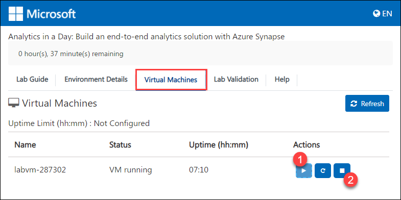
 
### Instructor Azure Portal Access 

Instructor has access to all attendees Resource groups and resources that are pre-deployed or deployed by attendee as a part of the lab. 
1. Instructor can login to the Azure portal with the credentials identified before and will be able to view the resources of all attendees. 

   
 
   
 
1. Since each attendee is assigned with a six-digit Suffix, it is easy for the instructor to view the resources of a particular attendee.  

   To find the attendees details:  

     - From the Cloud Labs portal home page, Click on **On Demand Labs** select the event ODL then click on user's tab from actions. From here, instructor can find the list of attendees with their deployment id and deployment details for each user. 
     - From the list of attendees, instructor can pick the Suffix of the desired attendee and can view the resources from the Azure portal. 

## How much time does the environment take to get deployed? 

- The approximate Duration for deploying a single environment would be 45 minutes. 

## The total duration of this lab is 4 hours 

- The attendee will have access to the lab environment for 4 hours, unless notified otherwise. 

## What do the attendees get when they sign up for the environment?

1. As soon as the attendee’s environment is deployed, he will be able to see a virtual machine on the left which will be used to perform the lab. 

 1. On the right, Attendee will be able to find 

     1. A lab guide, which should be followed to perform the lab.  

          - Attendee can see the number on lab guide bottom area to switch to different exercises of lab guide.  

          - Attendee can also navigate to previous and next exercise using Previous and Next button. 
             
         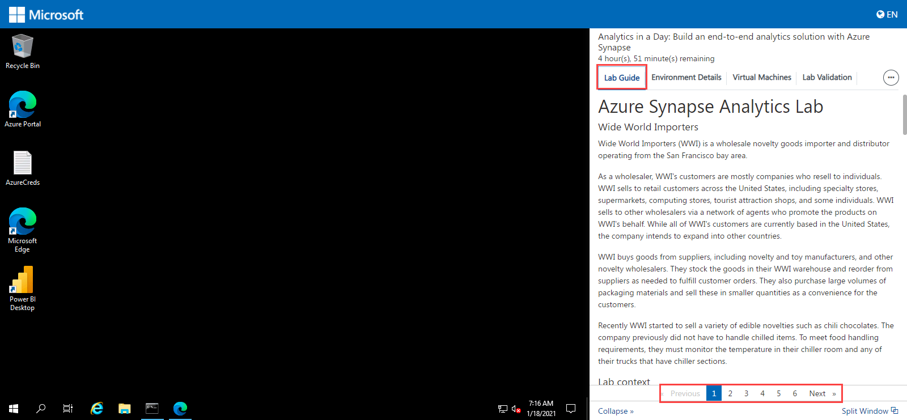 
           
     1. Environment Details which include user credentials (Azure Credentials), Virtual Machine Credentials and other details. 
     
         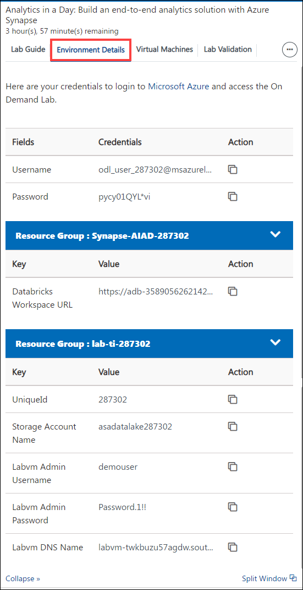 

     1. Virtual Machines tab, attendee can find the available virtual machines, their status (running, pending or deallocated), Uptime and can also perform some actions on them.

          

          - Attendee can also perform the following operations on the virtual machine. 

               1. Start 

               2. Restart and

               3. Stop  

          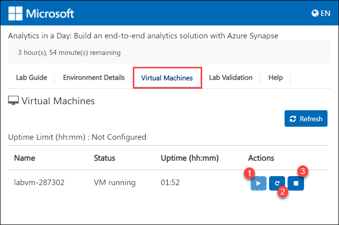 
          
     1. From the Lab Validation tab, attendees can run validation for each exercise after performing it. 

          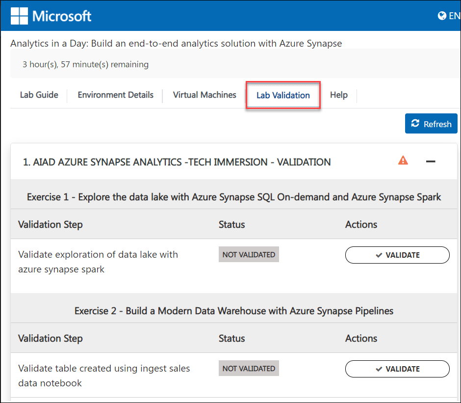  
          
          
### Help Tab

1. Expand **More** button on the right and click on **Help**.  

    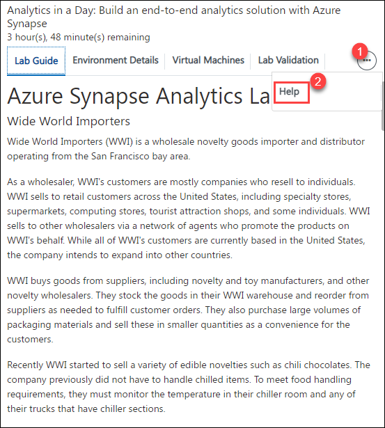
    
2. From Help tab, attendees can find the common issues such as copy-paste, pop-up visibility issues and solutions to resolve them. 

    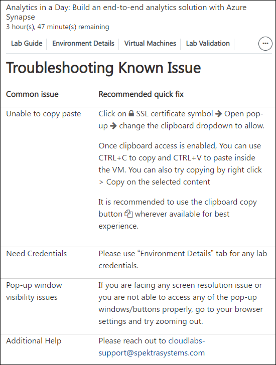
   
   
### Split Window

- Split window will open the lab guide in new Window by providing the only virtual machine on the current window. 

    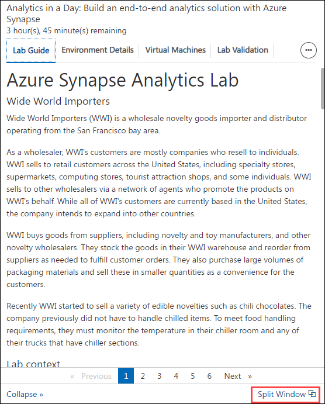

### Collapse Window

1. Collapse button will collapse the lab guide window and provides the full view of the virtual machine.  

    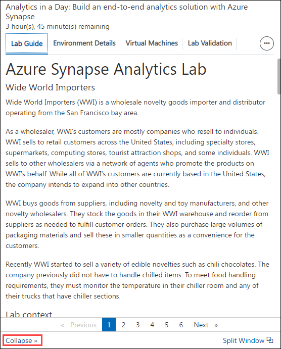
    
2. Attendee can get back the lab guide when needed by clicking on Expand button. 

    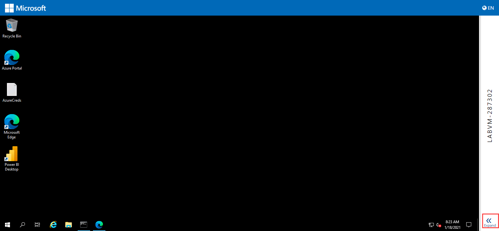 

## Resources that are provided as pre-requisites

- Once the attendee’s login to the Azure portal, the following are the Pre-deployed resources that are provided to the attendees to perform the lab. 
   - Resource Groups: Synapse-AIAD-UniqueID 
   - Resources deployed in Synapse-AIAD-UniqueID: 
   
      - Storage account - asadatalakeUniqueID and asastoreUniqueID
      - Azure Databricks Service - UniqueID
      - Synapse workspace - asaworkspaceUniqueID 
      - Apache Spark pool - SparkPool01 (asaworkspaceUniqueID/SparkPool01) 
      - Dedicated SQL pool - SQLPool01 (asaworkspaceUniqueID/SQLPool01) 

## LAB CONTENTS 

### Exercise 1: Explore the data lake with Azure Synapse SQL On-demand and Azure Synapse Spark

Azure Synapse Analytics provide the possibilities of using either the SQL Serverless engine, the big-data Spark engine, or both. In this exercise, attendee will explore data using the engine of your choice (SQL or Spark). 

### Exercise 2: Build a Modern Data Warehouse with Azure Synapse Pipelines

In this exercise, attendee will use a pipeline with parallel activities to bring data into the Data Lake, transform it, and load it into the Azure Synapse SQL Pool and will also monitor the progress of the associated tasks. 

Attendee will use notebooks and Data Flows to ingest, transform, and load data. Also will examine various methods for ingesting data into Azure Synapse Analytics and Azure Data Lake Storage Gen2. 

### Exercise 3: Power BI integration

Azure Synapse Analytics integrates natively with Power BI, a proven and highly successful data presentation and exploration platform. The Power BI experience is available inside Synapse Studio. In this exercise, attendee will create a Power BI Report and build a visualization within Synapse Analytics Studio. 

### Exercise 4: High Performance Analysis with Azure Synapse SQL Pools

In this exercise, attendee will try to understand customer details using a query and chart visualizations Then will  explore the performance of various queries. 

### Exercise 5 - Data Science with Azure Synapse Spark [Read-Only]

Azure Synapse Analytics provides support for using trained models (in ONNX format) directly from dedicated SQL pools. Which means that data engineers can write T-SQL queries that use those models to make predictions against tabular data stored in a SQL Pool database table.

In this exercise, attendee will leverage a previously trained model to make predictions using the T-SQL Predict statement.

 ### Lab validation

After performing each exercise, the attendees are asked to run validation for the provided tasks to ensure that the expected output is obtained. 

1. Expand lab validation details and click on validate button. 

    

2. Attendees can find the validation status either Succeeded or failed under status tab 

     - If the validation fails, it will give the error message regarding why the validation has failed so that attendee can find the mistake which he committed and rectify it accordingly. 

    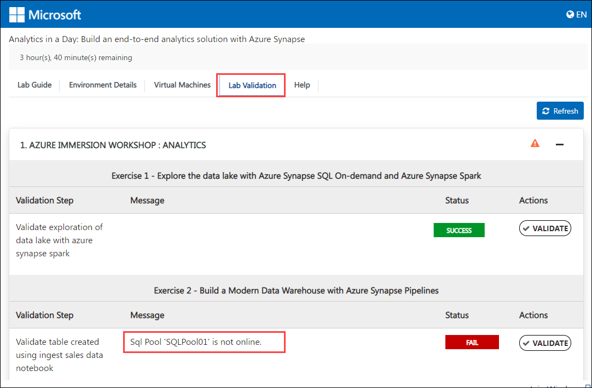
    
    
## Known Issues and workarounds 

1. The dedicated SQL pool is paused by default, the attendee must resume the pool before performing the lab by 

    - Navigateto the **Synapse-AIAD-287302** resource group from the Azure portal.
    - Select dedicated SQL pool **SQLPool01 (asaworkspaceUniqueID/SQLPool01)** and click on **Resume**. 

1. If attendee face issues while trying to access the environment, follow the below steps:

    - They can check to see if the VM is in the running state, if not they can start it from the Virtual machine tab. 
  
    - It could also be due to a duplicate window open in another browser, we suggest closing all windows and trying again. Or using a private window and clearing the cookies.  

1. Issue with Spark pool:

	**Failed to start the Spark Session error**
	
	Solution: **Refresh** the browser tab
	
      There might be multiple notebooks open because of which this issue occurs usually ,Refresh will work and also users can cancel any existing spark applications if they are still running under Monitor section
      
1. If **SQL Built in/on demand** is **Unreachable/Offline**, then

     - Your network prevents communication to Azure Synapse backend. Most frequent case is that port 1443 is blocked. To get the builtin to work, unblock this port. Other problems could prevent builtin to work as well. Attendee can follow the below link to troubleshoot the issue.
     
        https://docs.microsoft.com/en-us/azure/synapse-analytics/troubleshoot/troubleshoot-synapse-studio

1. Sometimes core capacity of the **spark pool** can exceed, attendee can refresh the browser/stop the session then restart it and try to access again. 

1. If the attendee is not able to find the options **Connect to** to attach spark pool and **Language** that is to be used, attendee can follow any on the listed solutions to reslove the issue.

      1. Attendee needs to reset the zoom level accordingly so that he will be able to see the options and provide values accordingly.
      1. Attendee can click on more button (**...**), then he will be able to see the options and provide values accordingly.
      
           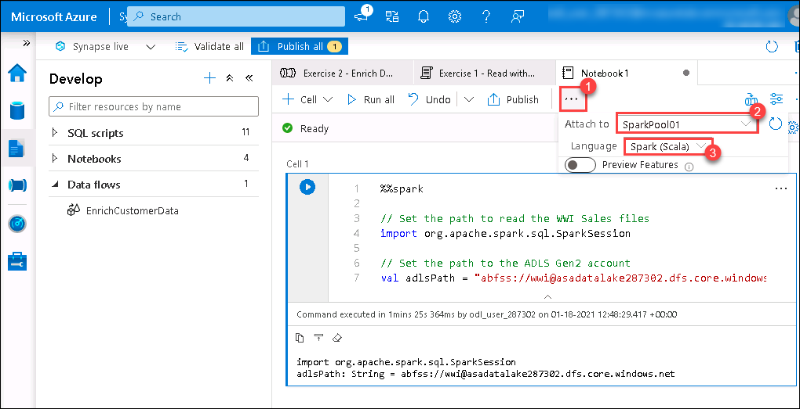

1. Exercise 3 Task 2 - Create a Power BI report in Synapse  

   If attendee is not able to see a list of data fields under Fields, follow the steps 1-14 given in the lab guide after step 2.

1. Exercise 3: Power BI integration 

     Sometimes the PowerBI licence does not get assigned automatically. If the attendee is unable to find the PowerBI workspace, they can follow the below steps to create a new workpace:
     
     1. Navigate to PowerBI Portal  www.powerbi.com 
     2. Sign in using the Azure Credentials, you can find the Credentials from the **Environment Details** tab.
     
          
              
     3. From the left-hand side menu, select **Workspaces** then click on **Create a workspace**.
     
         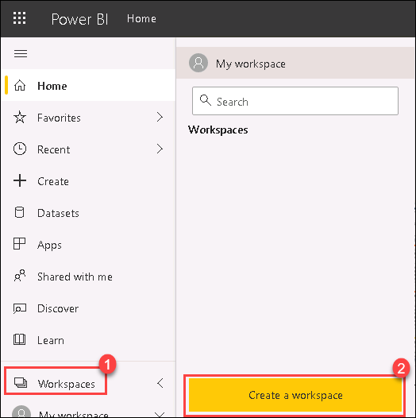
     
     4. Provide worskpace name as **PowerBIWorkspace{Uniqueid}** and click on **Save**. You can find the **Uniqueid** from the **Environment Details** tab.
     
         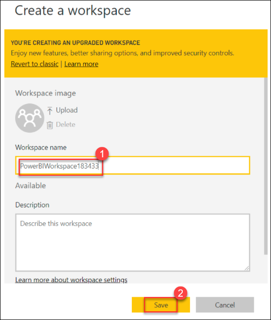
         
     5. Launch Synapse studio, select **Manage** from the left-hand side menu and click on **Linked services**.
     
         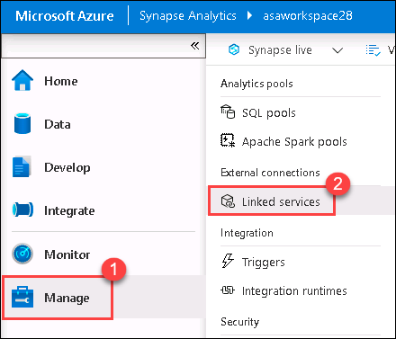
              
     6. Click on **+New**, serach for and slect **PowerBI** then click on **Continue**.
     
         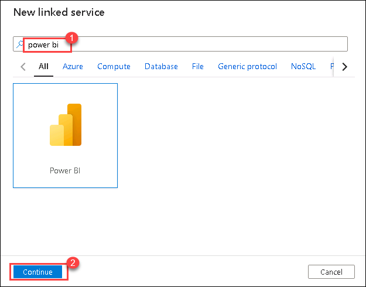
              
     7. On the **New linked service (Power BI)** blade, provide the following values and click on **Create**.
     
           - Name : **PowerBIWorkspace**
           - Tenant: select the tenant from the dropdown.
           - Worskpace name : select the workspace **PowerBIWorkspace{Uniqueid}** from the dropdown.

         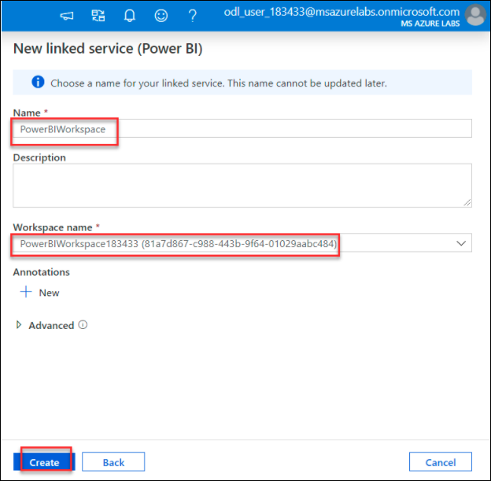
         
1. Exercise 3: Power BI integration 

    - Power BI desktop is already downloaded and installed in the virtual machine provided with the lab; the attendees do not have to download it again.

1. Attendee will not be able to perform **Exercise 5 - Data Science with Azure Synapse Spark** as it is Read-Only exercise.

      - Even though synapse workspace is generally available now ,the PREDICT function is still in private preview and needs explicit whitelisting so the Exercise 5 is READONLY AND attendee won't be able to  perform this exercise

## FAQ’S

### How to access lab environment

1. Instructor share the bit.ly link and activation code during the event to attendees. 

    DO NOT share the activation details prior to session (Lab Start time) 

1. All attendees activate the lab instance using the same activation code. 

    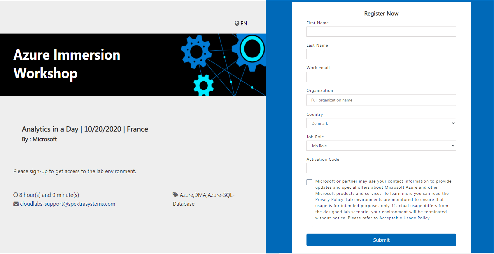

1. Attendee will navigate to the bit.ly link and provide the required details. 
1. Its mandatory to give company email address and actual organization name. 

    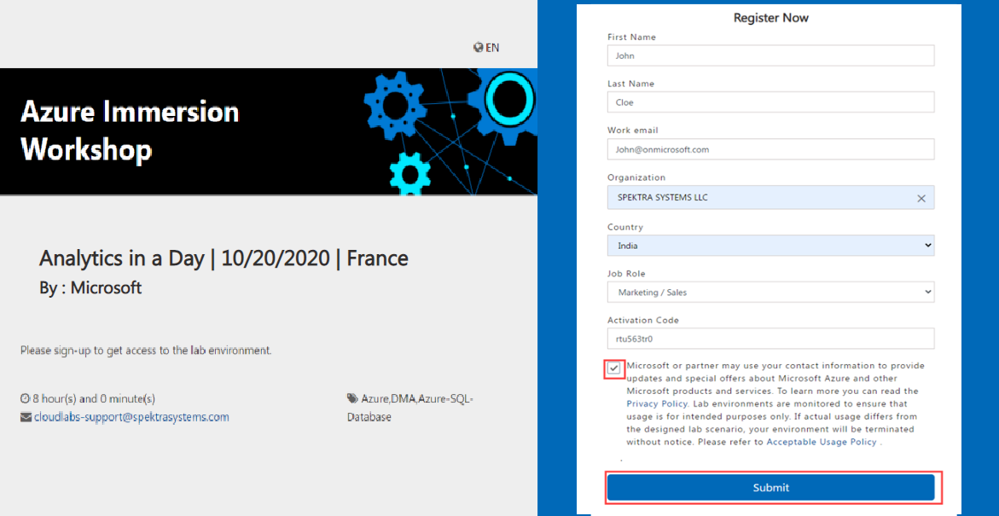
        
1. Once lab instance is assigned, details are also sent to attendee via email from [noreply@cloudlabs.ai 
  ](mailto:noreply@cloudlabs.ai) 
1. Once attendee register using Lab activation details, he will click on Launch Lab to get started with the lab. 

   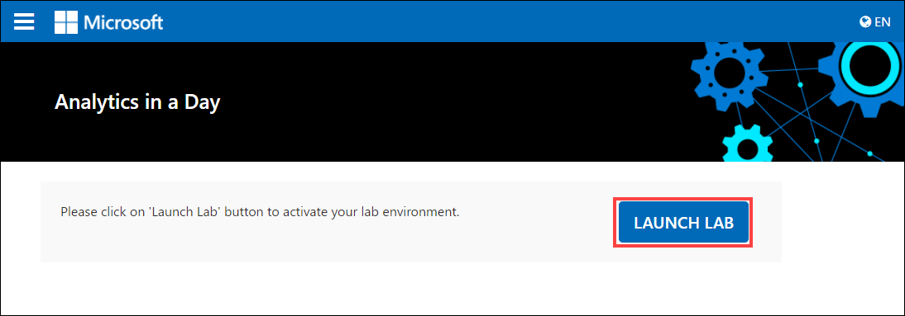
    
1. Once the deployment is succeeded, attendee will get the screen with the lab guide, Environment Details (Azure Credentials), etc. on the Right Side and Virtual Machine on the Left. 

  

### How to find the **UniqueId** Value:

- Attendee can find the UniqueId value by navigating to **Environment Details** page. 

    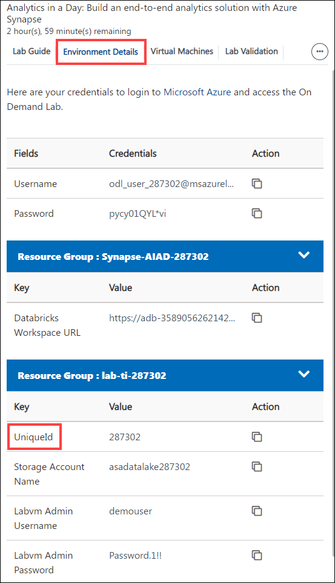

