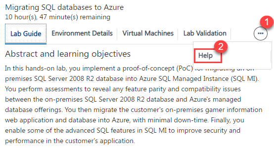
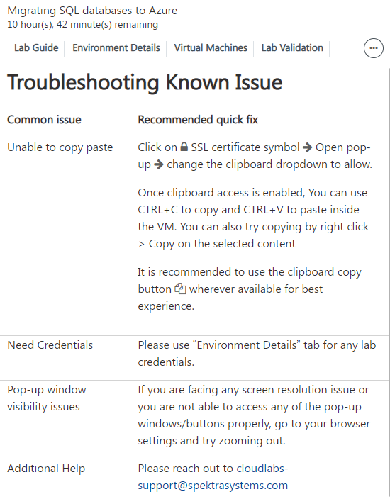
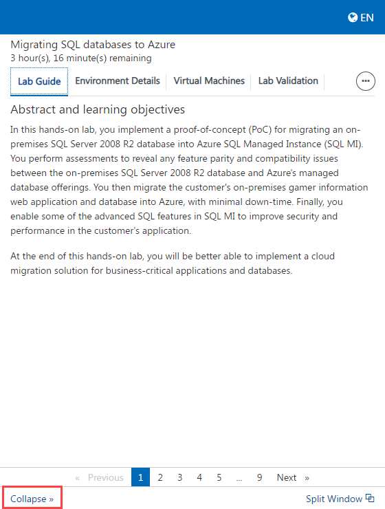
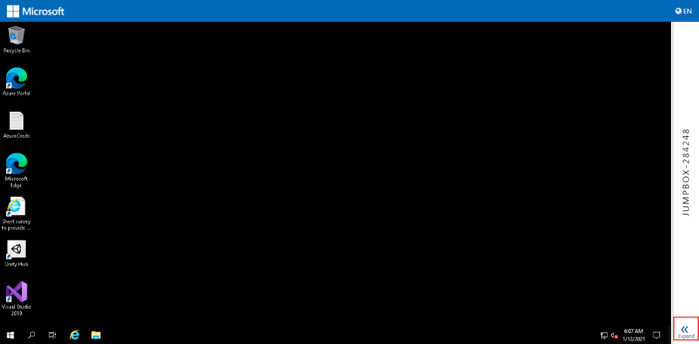

# Analytics in a Day: Build an end-to-end analytics solution with Azure Synapse

## How much time does the environment take to get deployed? 

- The approximate Duration for deploying a single environment would be 45 minutes. 

 

## The total duration of this lab is 4 hours 

- The attendee will have access to the lab environment for 4 hours, unless notified otherwise. 

## What do the attendees get when they sign up for the environment.  

1. As soon as the attendee’s environment is deployed, he will be able to see a virtual machine on the left which will be used to perform the lab. 

 1. In the right, Attendee will be able to find 

     1. A lab guide, which should be followed to perform the lab.  

          - Attendee can see the number on lab guide bottom area to switch to different exercises of lab guide.  

          - Attendee can also navigate to previous and next exercise using Previous and Next button. 
             
            
           
     1. Environment Details which include user credentials (Azure Credentials), Virtual Machine Credentials and other details. 

     1. Virtual Machines tab, attendee can find the available virtual machines, their status (running, pending or deallocated), Uptime and can also perform some actions on them.

           

          - Attendee can also perform the following operations on the virtual machine. 

               1. Start 

               2. Restart and

               3. Stop  

     1. From the Lab Validation tab, attendees can run validation for each exercise after performing it. 

           
          
### Help Tab

1. Expand **More** button on the right and click on **Help**.  

    
    
2. From Help tab, attendees can find the common issues such as copy-paste, pop-up visibility issues and solutions to resolve them. 

    
   
   
### Split Window

- Split window will open the lab guide in new Window by providing the only virtual machine on the current window. 

    

### Collapse Window

1. Collapse button will collapse the lab guide window and provides the full view of the virtual machine.  

    
    
2. Attendee can get back the lab guide when needed by clicking on Expand button. 

     

## Resources that are provided as pre-requisites. 

- Once the attendee’s login to the Azure portal, the following are the Pre-deployed resources that are provided to the attendees to perform the lab. 
   - Resource Groups: Synapse-AIAD-UniqueID 
   - Resources deployed in Synapse-AIAD-UniqueID: 
   
      - Storage account - asadatalakeUniqueID and asastoreUniqueID
      - Azure Databricks Service - UniqueID
      - Synapse workspace - asaworkspaceUniqueID 
      - Apache Spark pool - SparkPool01 (asaworkspaceUniqueID/SparkPool01) 
      - Dedicated SQL pool - SQLPool01 (asaworkspaceUniqueID/SQLPool01) 

## LAB CONTENTS 

### Exercise 1: Explore the data lake with Azure Synapse SQL On-demand and Azure Synapse Spark

In this exercise, you will explore data using the engine of your choice (SQL or Spark). 

Understanding data through data exploration is one of the core challenges faced today by data engineers and data scientists as well. Depending on the data's underlying structure and the specific requirements of the exploration process, different data processing engines will offer varying degrees of performance, complexity, and flexibility. 

In Azure Synapse Analytics, you have the possibility of using either the SQL Serverless engine, the big-data Spark engine, or both. 

### Exercise 2: Build a Modern Data Warehouse with Azure Synapse Pipelines

In this exercise, you will use a pipeline with parallel activities to bring data into the Data Lake, transform it, and load it into the Azure Synapse SQL Pool. You will also monitor the progress of the associated tasks. 

Once data is properly understood and interpreted, moving it to the various destinations where processing steps occur is the next big task. Any modern data platform must provide a seamless experience for all the typical data wrangling actions like extractions, parsing, joining, standardizing, augmenting, cleansing, consolidating, and filtering. 

Azure Synapse Analytics provides two significant categories of features - data flows and data orchestrations (implemented as pipelines). They cover the whole range of needs, from design and development to triggering, execution, and monitoring. 

In this exercise, you examine various methods for ingesting data into Azure Synapse Analytics and Azure Data Lake Storage Gen2. You use notebooks and Data Flows to ingest, transform, and load data. 

### Exercise 3: Power BI integration

In this exercise, you will build a Power BI report in Azure Synapse Analytics. 

The visual approach in data exploration, analysis, and interpretation is one of the essential tools for both technical users (data engineers, data scientists) and business users. Having a highly flexible and performant data presentation layer is a must for any modern data platform. 

Azure Synapse Analytics integrates natively with Power BI, a proven and highly successful data presentation and exploration platform. The Power BI experience is available inside Synapse Studio. 

In this exercise, you will realize another benefit of the fully integrated environment provided by Azure Synapse Analytics. Here, you will create a Power BI Report and build a visualization within Synapse Analytics Studio. Once you have published a dataset, you will not have to leave this environment to log into a separate Power BI website to view and edit reports. 

The Power BI Workspace has already been created for you. 

### Exercise 4: High Performance Analysis with Azure Synapse SQL Pools

In this exercise, you will try to understand customer details using a query and chart visualizations. You will also explore the performance of various queries. 

SQL data warehouses have been for a long time the centres of gravity in data platforms. Modern data warehouses can provide high performance, distributed, and governed workloads, regardless of the data volumes at hand. 

The Azure Synapse SQL Pools in Azure Synapse Analytics is the new incarnation of the former Azure SQL Data Warehouse. It provides all the modern SQL data warehousing features while benefiting from the advanced integration with all the other Synapse services. 

## Known Issues and workarounds 

- The attendees can reach out at <cloudlabs-support@spektrasystems.com> for any queries/support 

- If the attendee is unable to copy paste in the environment, they can follow the steps below  

Click on SSL certificate symbol Open pop-ups and change the clipboard dropdown to allow. 

Once clipboard access is enabled, you can use CTRL+C to copy and CTRL+V to paste inside the VM. You can also try copying by right click > Copy on the selected content. It is recommended to use the clipboard copy button wherever available for best experience. 

- The dedicated SQL pool is paused by default, the attendee must resume the pool before performing the lab by going to the Synapse analytics resource group and selecting the SQL Pool and resume. 

- The dedicated SQL pool is auto paused due to inactivity. The attendee must resume to SQL pool again from the Resource group to complete the remaining exercises. 

- The attendees may face issues while trying to access the environment, 
  they can check to see if the VM is in the running state, if not they can start it from the Virtual machine tab. 
  It could also be due to a duplicate window open in another browser, we suggest closing all windows and trying again. Or using a private window and clearing the cookies.  

- The attendee may get an error saying failed to start the spark session, there might be multiple notebooks open because of which this issue occurs usually, Refresh will work, and users can cancel any existing spark applications if they are still running under Monitor section 

- SQL on demand/Built in can at times be Unreachable/Offline, this can be due to your network preventing communication to Azure Synapse backend. Most frequent case is that port 1443 is blocked. To get the SQL pool to work, unblock this port. 

- Exercise 2: Explore the data lake with Azure Synapse SQL On-demand and Azure Synapse Spark  

The core capacity of the spark pool can sometimes exceed, the user can refresh the browser/stop the session then restart it and try to access again. 

- Exercise 3 - Power BI integration 

Task 2 - Create a Power BI report in Synapse  

If you do not see a list of data fields under Fields, follow the steps given in the lab guide after step 2 

- Exercise 3: Power BI integration 

Sometimes the PowerBI licence does not get assigned automatically. If the user is unable to find the PowerBI workspace, they can notify us on the support channel.  

- Exercise 3: Power BI integration 

Power BI desktop is already present in the virtual machine provided with the lab; the attendees do not have to download it again. (They still must download the dataset at the beginning of exercise 3) 

