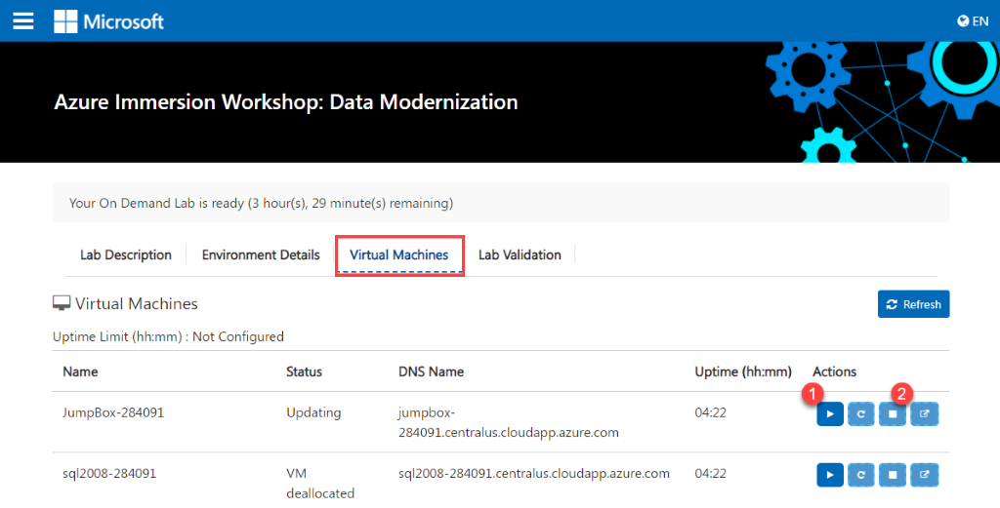
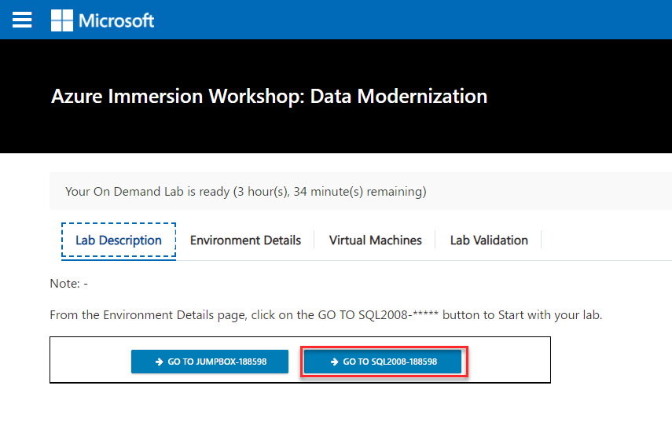
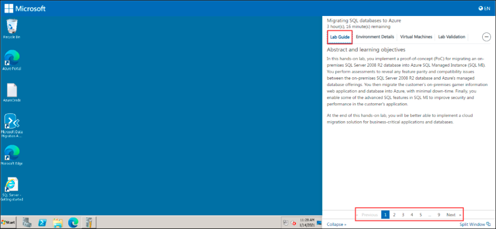
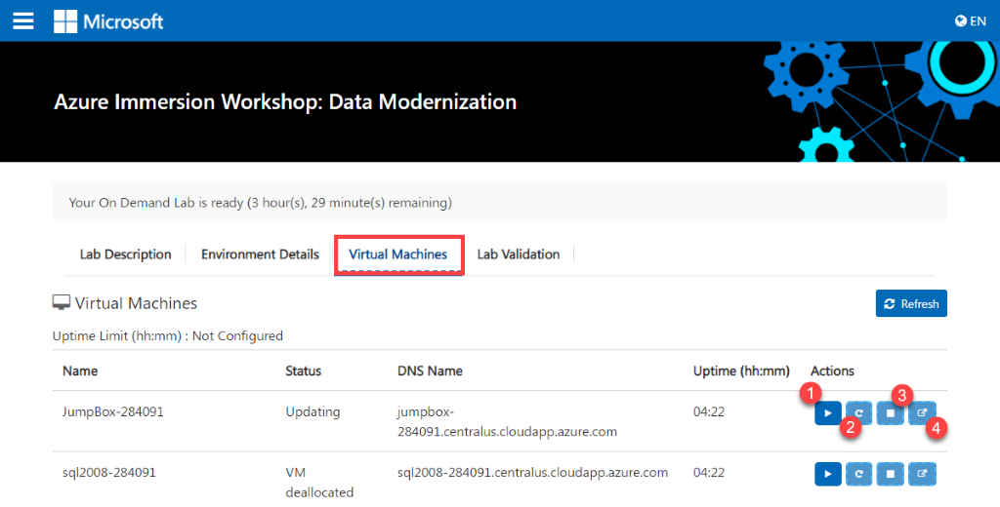
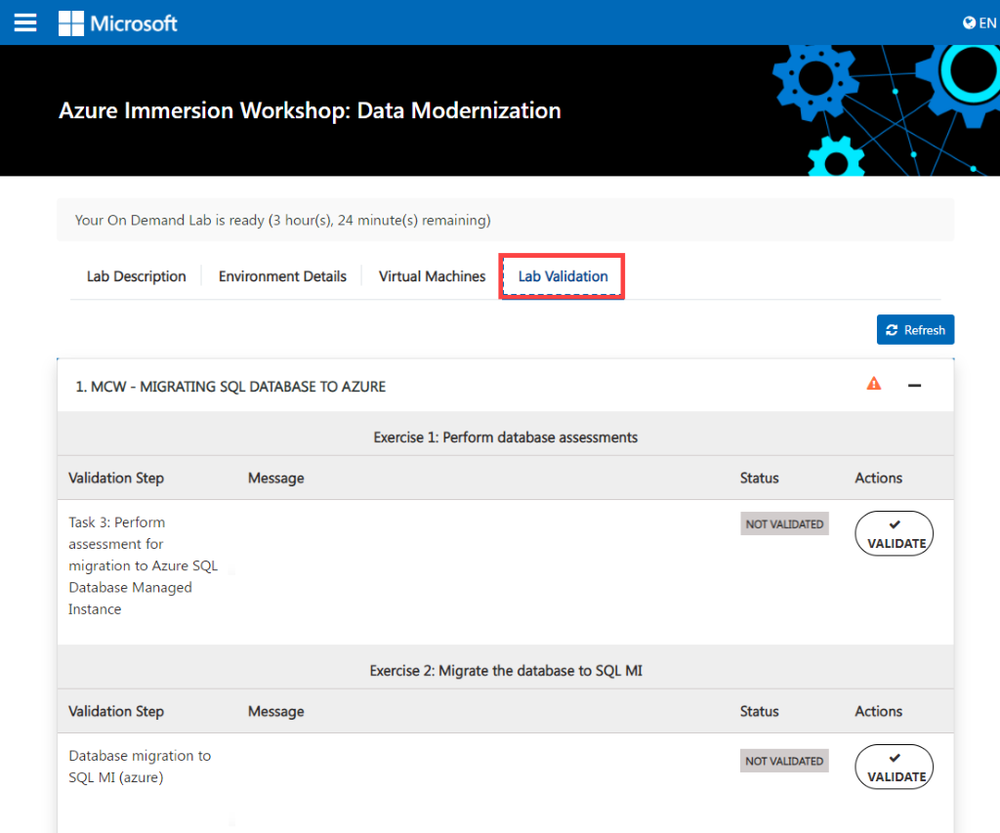

# MIGRATING SQL DATABASE TO AZURE

## How to navigate to the cloud labs portal

- Open any browser and navigate to <https://admin.cloudlabs.ai/>  
- Click on sign in and then sign with Work or School Account.  
- Upon login, on demand lab will be available for management. 

   1. Ensure to select the right Cloud Labs tenant. 
   2. Navigate to On Demand Labs, then you will be able to find event ODL name.  
   3. From here you can find instructor credentials. With this credential you can access all the attendee’s azure environments. 
   4. From Users tab, you can find list of lab users with their deployment id. 
   
 
 
## How to manage users and Unused instances

- Navigate to user's tab from actions..  
- From here you can find the list of users with their deployment id and deployment details for each user.  
- You can manage attendees from this page  
- Add / Remove attendees  
- Each attendee is assigned a six-digit unique id to identify lab resource groups and jump VMs 

 

## Features available to instructors

### Vm Shadowing  

- You can shadow multiple attendee VMs at the same time.  
- Multiple instructors / proctors can shadow same attendee VM concurrently.  
- If you don’t see the username upon clicking “Shadow Session”, student may not have launched their Lab VM yet or is disconnected.  

1. Login to [https://admin.cloudlabs.ai](https://admin.cloudlabs.ai/) with your work account (<alias@microsoft.com> or <alias@partner.com>)   
1. Ensure to select the right Cloud Labs tenant (Microsoft – In a Day)  
1. Navigate to On Demand Labs  
1. Using instructor credentials, you can access all the attendee’s azure environments.  
    - Click on information icon from Actions to get Instructor Azure Credentials  
    - Use this username and password to login to Azure portal and CloudLabs Shadow  
    - Login from a private browser instance (InPrivate or Incognito)  

     

1. Navigate to user's tab from actions  
1. You can find the Deployment details for the user here. (you can use azure credentials from this page to access attendee cloud environment)  

   
 
   SCREEN CONNECT  

1. Navigate to [https://spektrasystems.screenconnect.com](https://spektrasystems.screenconnect.com/)  
1. Click on Login  

   

1. Login with local account, do not choose Azure AD.  
1. Use same username and password provided for Instructor Access  

    
 
    

1. OTP is sent to your work email account. Check and provide the OTP then Login.  
     - Please be sure to check junk/spam folder.  
     - Email is sent out from <cloud@screenconnect.com>  

    

1. Search for specific DID if needed, right Click on Lab User VM (Identified by DID) and Select Shadow Session  

    

1. Select Login Session – demouser or if you see any other username to connect the VM and click on Join Session 

    >Note: If you only see Console and [Backstage], that means attendee is not connected to VM currently  

    

1. Click on Open ScreenConnect Client and install the required software (One Time).  

    
    
1. Shadow users VM session (without overtaking RDP session).

    
1. You can initiate a private chat with attendee by clicking on messaging icon.

    

### RDP OVER HTTPS  

- Rdp over https is a feature which allows attendees to access the virtual machine over the internet. This eliminates the need of logging in into the vm by attendees.   

- With RDP OVER HTTPS and integrated doc rendering, attendees will be able see the virtual machine and lab guide on the same screen which makes easier to perform the lab.  

 
 
### VM Start/Stop  

- Attendees can start/stop the Virtual Machine from the Virtual Machine tab. We have provided button to start/stop VM under Actions.  

 
 
## Instructor Azure Portal Access 

Instructor has access to all attendees Resource groups and resources that are pre-deployed or deployed by attendee as a part of the lab. 
1. Instructor can login to the Azure portal with the credentials identified before and will be able to view the resources of all attendees. 

   
 
   
 
1. Since each attendee is assigned with a six-digit Suffix, it is easy for the instructor to view the resources of a particular attendee.  

   To find the attendees details:  

1. From the Cloud Labs portal home page, Click on **On Demand Labs** select the event ODL then click on user's tab from actions. From here, instructor can find the list of attendees with their deployment id and deployment details for each user. 
1. From the list of attendees, instructor can pick the Suffix of the desired attendee and can view the resources from the Azure portal. 

### How much time does the environment take to get deployed? 

- The approximate Duration for deploying a single environment would be **30** minutes. 

### What do the attendees get when they sign up for the environment.  

1. As soon as attendee’s environment is deployed, he will be able to see the Lab Description page.  

    

1. From the Environment Details tab, attendees can find the Azure Credentials, Virtual Machine Credentials, Service Principal details and other details that are required to perform the lab. 

    
 
1. Scroll down on the Environment Details page and click on the **JumpBox-Suffix**   button to login to the Jumpbox VM. 

   
 
   - Then attendee will be able to see a JumpBox virtual machine in the left to perform the lab and a lab guide in the right which need to be followed throughout the lab. 
   
    

1. Scroll down on the Environment Details page and click on the **GO TO SQL2008-Suffix** button to login to the SQL server VM.  

    

   - Then attendee will be able to see the SQL virtual machine in the left to perform the lab and a lab guide in the right which need to be followed throughout the lab. 

     

     - Attendee can see the number on lab guide bottom area to switch to different exercises of lab guide.  
     - Attendee can also navigate to previous and next exercise using **Previous** and **Next** button. 

    

1. From the Virtual Machines tab, attendee can find the available virtual machines, their status ( running, pending or deallocated), Uptime, DNS name and can also perform some actions on them. 

    
   
    - Attendee can also perform the following operations on the virtual machine. 

               1. Start 

               2. Restart 

               3. Stop and 

               4. Open the virtual machine in new tab. 

     
      
1. From the Lab Validation tab, attendees can run validation for each exercise after performing it. 

    

### Resources that are provided as pre-requisites. 

Once the attendee login to the Azure portal, following are the Pre-deployed resources that are provided to the attendees to perform the lab. 

- Resource Group: hands-on-lab- Suffix, SQLMI-Shared-RG 

 **Resources deployed in hands-on-lab-Suffix:** 

 - Virtual machine:  sqlVirtualMachine (sql2008-Suffix), JumpBox-Suffix 
 - Network security group: JumpBox-Suffix-nsg, sql2008-Suffix-nsg 
 - Network Interfaces: JumpBox-Suffix-nic, sql2008-Suffix-nic 
 - Public Ip Address: JumpBox-Suffix-ip, sql2008-Suffix-ip, vnet-gateway-ip 
 - Data Migration service: wwi-dms 
 - Storage Account: sqlmistoreuniqueString 
 - AppService Plan Name: hands-on-lab-Suffix-asp 
 - WebApp Name: wwi-web-Suffix 

 **Resources deployed in SQLMI-Shared-RG:**

 - Virtual Network Gateway: hands-onlab-vnetgateway 
 - Network security group: nsg-sqlmi—cus 
 - SQL Managed Instance: sqlmi-cus 

  In the upper left corner of the portal window, click the toggle menu icon and then click on **Resource groups,** then select the** hands-on-lab-Suffix/SQLMI-Shared-RG resource group and view the pre-deployed resources**.** 

### LAB CONTENTS

**Exercise 1: Perform database assessments** 

In this exercise, attendee will the Microsoft Data Migration Assistant (DMA) to perform assessments on the WideWorldImporters database. You create two assessments: one for SQL DB and a second for SQL MI.  

These assessments provide reports about any feature parity, and compatibility issues between the on-premises database and the Azure managed SQL database service options. 

**Exercise 2: Migrate the database to SQL MI** 

In this exercise, attendee will use the **Azure Database Migration Service** (DMS) to migrate the WideWorldImporters database from an on-premises SQL Server 2008 R2 database into Azure SQL Managed Instance (SQL MI). 

**Exercise 3: Update the web application to use the new SQL MI database** 

With the WideWorldImporters  database now running on SQL MI in Azure, attendee will publish the web app to Azure from visual studio then the next step is to make the required modifications to the WideWorldImporters web application to enable it to connect to and utilize the SQL MI database. 

**Exercise 4: Integrate App Service with the virtual network** 

In this exercise, attendee will integrate the WWI App Service with the virtual network that was created as a pre-requisite and verify that web application now loads, and can see the home page of the web app.  

**Exercise 5: Improve database security posture with Advanced Data Security** 

In this exercise, attendee will enable Advanced Data Security (ADS) on your SQL MI database and explore some of the security benefits that come with running your database in Azure. 

SQL Database Advance Data Security (ADS) provides advanced SQL security capabilities, including functionality for discovering and classifying sensitive data, surfacing and mitigating potential database vulnerabilities, and detecting anomalous activities that could indicate a threat to your database. 

**Exercise 6: Enable Dynamic Data Masking** 

In this exercise, attendee will enable Dynamic Data Masking (DDM) on credit card numbers in the  WideWorldImporters  database. 

DDM limits sensitive data exposure by masking it to non-privileged users which helps prevent unauthorized access to sensitive data. It is a policy-based security feature that hides the sensitive data in the result set of a query over designated database fields, while the data in the database is not changed. 

### Lab validation

After performing each exercise, the attendees are asked to run validation for the provided tasks to ensure that the expected output is obtained. 

1. Expand lab validation details and click on validate button. 

 

2. Attendees can find the validation status either Succeeded or failed under status tab 

     - If the validation fails, it will give the error message regarding why the validation has failed so that attendee can find the mistake which he committed and rectify it accordingly. 

    

### Help Tab

1. Expand **More** button on the right and click on **Help**.  

    

2. From Help tab, attendees can find the common issues such as copy-paste, pop-up visibility issues and solutions to resolve them. 

     
   
   
### Split Window

- Split window will open the lab guide in new Window by providing the only virtual machine on the current window. 

 

### Collapse Window

1. Collapse button will collapse the lab guide window and provides the full view of the virtual machine.  

    

2. Attendee can get back the lab guide when needed by clicking on Expand button. 

    

**Average time taken to complete the lab: 8 hours** 

### Known issues

**IMPORTANT!!** 

Whenever attendee is asked to provide value for SUFFIX, it should be replaced with value which can be found from the Environment Details page. Not providing the SUFFIX value will lead to **Deployment issues** while deploying new resources, **Connection issues:** while connecting to database using **Microsoft SQL Server Management Studio 17(SSMS)** and** while performing **Database Assessment and Database Migration**. 

**Exercise2 Task4 Step5:** 

While creating the storage account, make sure attendee provide the values as follows: 

- Resource group: select existing then provide name hands-on-lab-SUFFIX 
- Storage account: select Create new then provide name as **shellstorageSUFFIX** 
- file share: select Create new then provide name as **shellfileSUFFIX** then create storage 

Attendees can find the SUFFIX value from the Environment Details page. 

**Exercise4 Task1 step4:** 

Here attendee needs to select available subnet for the app service, if the attendee is not able to select any subnet then attendee needs to follow the next instructions to create the subnet. while creating the subnet users' needs to make sure the subnet address space is not overlapping other subnet's address space 

### FAQ’S

**How to access lab environment** 

1. Instructor share the bit.ly link and activation code during the event to attendees. 

    DO NOT share the activation details prior to session (Lab Start time) 

1. All attendees activate the lab instance using the same activation code. 

    

1. Attendee will navigate to the bit.ly link and provide the required details. 
1. Its mandatory to give company email address and actual organization name. 

    

1. Once lab instance is assigned, details are also sent to attendee via email from [noreply@cloudlabs.ai 
  ](mailto:noreply@cloudlabs.ai) 
1. Once attendee register using Lab activation details, he will click on Launch Lab to get started with the lab. 

     
    
1. Once the deployment is succeeded, attendee will get the Lab description page with Azure Credentials**,** Virtual Machine Credentials, Service Principal details and **other details that are required to perform the lab**, click on **GO TO SQL2008-Suffix** button to login to the SQL server VM and start with lab.   

    
   
1. Attendee will get the screen with the lab guide, Environment Details (Azure Credentials), etc. on the Right Side and Virtual Machine on the Left. 

    

**How to find the **SUFFIX** Value:** 

- Attendee can find the SUFFIX value by navigating to **Environment Details** page. 

 

**How to find the **SERVICE PRINCIPAL** Details:**

- Attendee can find the service principal details by navigating to **Environment Details** page. 

 

